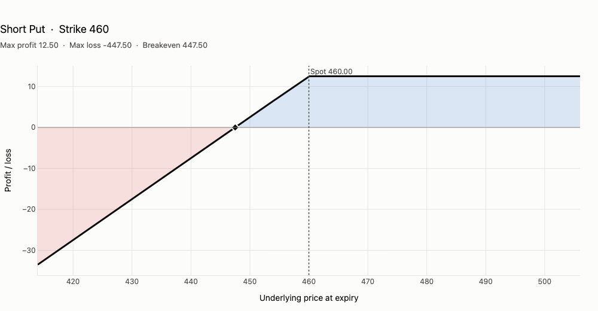
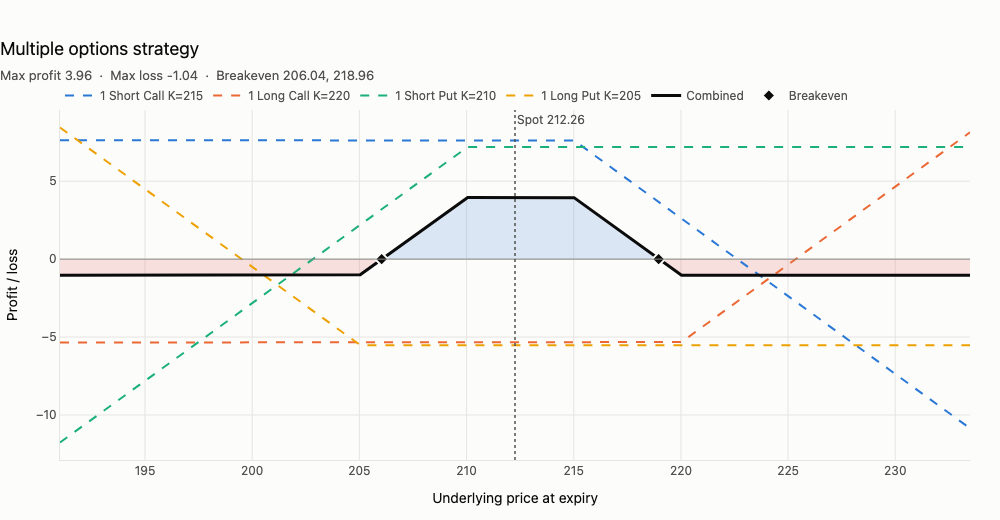
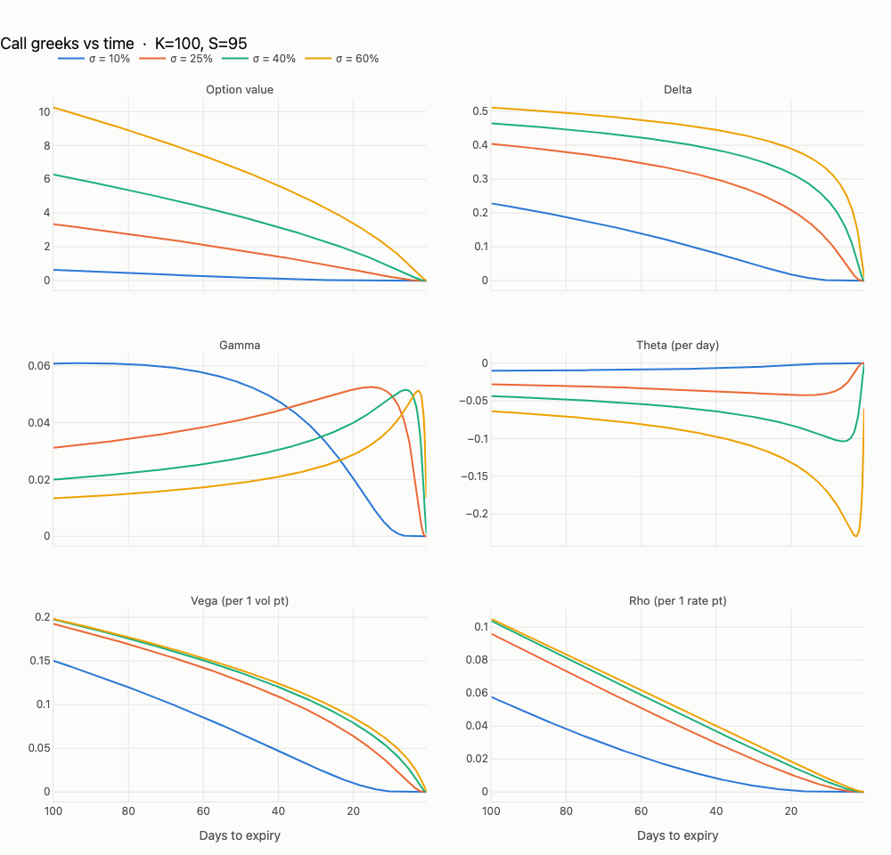

# opstrat 2.0

[](https://github.com/hedge-design/opstrat)
[](LICENSE)
[](pyproject.toml)
[](https://plotly.com/python/)

Python library for visualizing option strategies: interactive payoff diagrams and
Black-Scholes greeks built on [Plotly](https://plotly.com/python/).

This is a modernised fork of [hashABCD/opstrat](https://github.com/hashABCD/opstrat)
(v0.1.7, matplotlib). The 0.x function names and leg dicts still work; see
[Migrating from 0.x](#migrating-from-0x).

## What's new in 2.0

* **Interactive Plotly figures**: hover for per-leg and combined P/L, zoom, light and
  dark themes, and HTML export. Every plotter returns a `plotly.graph_objects.Figure`.
* **Exact strategy statistics**: max profit, max loss (including "Unlimited") and
  breakevens are solved analytically and shown on every chart, or via `op.summarize()`.
* **Vectorised Black-Scholes**: pass arrays for any input, with an optional dividend
  yield and correct handling at expiry.
* **`greeks_plotter()`**: value and greeks against days to expiry or underlying price,
  one line per volatility.
* **yfinance 1.x support**: choose last, mid, bid or ask pricing, and get helpful errors
  for unknown strikes or expiries.
* **Modern packaging**: `pyproject.toml`, Python 3.10+, numpy 2, pandas 2, and a test
  suite. matplotlib and seaborn are gone, and yfinance is optional.

## Requirements
Python ≥ 3.10, numpy, scipy, plotly. Optional: `yfinance` + `pandas` for live chains,
`kaleido` for PNG/SVG/PDF export, and `nbformat` to display figures in Jupyter or VS Code
notebooks.

## Installation

2.0 is installed from GitHub. `pip install opstrat` from PyPI gives the old 0.1.7.

```bash
pip install "opstrat @ git+https://github.com/hedge-design/opstrat"            # core
pip install "opstrat[yf,notebook] @ git+https://github.com/hedge-design/opstrat"  # + live chains, notebooks
```

Extras: `yf` (Yahoo Finance chains), `notebook` (nbformat + ipykernel), `image` (kaleido,
for static image export), `dev` (pytest).

For development, install from a clone in editable mode:

```bash
git clone https://github.com/hedge-design/opstrat && cd opstrat
pip install -e ".[yf,notebook,dev]"
pytest
```

## Usage

```python
import numpy as np
import opstrat as op
```

Every plotter **returns a `plotly.graph_objects.Figure`**. In Jupyter it renders on its own;
in a script call `fig.show()` (or pass `show=True`). Each chart's subtitle shows the exact
max profit, max loss and breakevens.

### 1. `single_plotter()` — one option

```python
op.single_plotter(spot=460, strike=460, op_type='p', tr_type='s', op_pr=12.5)
```


| Parameter | Default | Meaning |
|---|---|---|
| `op_type` | `'c'` | `'c'` call, `'p'` put |
| `spot` | `100` | current underlying price |
| `spot_range` | `10` | plotted range, ± percent around spot |
| `strike` | `102` | strike price |
| `tr_type` | `'b'` | `'b'` long, `'s'` short |
| `op_pr` | `2` | option premium |
| `contracts` | `1` | number of contracts |
| `theme` | `'light'` | `'light'` or `'dark'` |
| `save`, `file`, `show` | `False`, `'fig.html'`, `False` | output control (see [Saving](#5-saving)) |

### 2. `multi_plotter()` — any multi-leg strategy

Legs are dicts (`op_type`, `strike`, `tr_type`, `op_pr`, optional `contracts`) or `op.Leg` objects.

```python
iron_condor = [
    {'op_type': 'c', 'strike': 215, 'tr_type': 's', 'op_pr': 7.63},
    {'op_type': 'c', 'strike': 220, 'tr_type': 'b', 'op_pr': 5.35},
    {'op_type': 'p', 'strike': 210, 'tr_type': 's', 'op_pr': 7.20},
    {'op_type': 'p', 'strike': 205, 'tr_type': 'b', 'op_pr': 5.52},
]
op.multi_plotter(spot=212.26, spot_range=10, op_list=iron_condor)
```


Pass `show_legs=False` to draw only the combined position, or `title=` to relabel.

### 3. `yf_plotter()` — priced from live Yahoo Finance chains

```python
op.yf_plotter(ticker='amzn', exp='default', price='mid',
              op_list=[{'op_type': 'c', 'strike': 230, 'tr_type': 'b'},
                       {'op_type': 'p', 'strike': 230, 'tr_type': 'b'}])
```
`exp='default'` uses the nearest expiry. `price` is `'last'` (default), `'mid'`, `'bid'`
or `'ask'`; zero quotes (e.g. after hours) fall back to the last trade. A bad strike or
expiry raises an error listing the nearest valid ones.

### 4. Black-Scholes and `greeks_plotter()`

```python
op.black_scholes(K=200, St=208, r=4, t=30, v=20, type='c')       # dict, same as 0.x
op.black_scholes(K=100, St=np.linspace(80, 120, 41), t=30, r=4, v=25)  # arrays work too
```
Optional `q` is a continuous dividend yield (percent). Theta is per calendar day;
vega and rho are per one percentage point.

```python
op.greeks_plotter(K=100, St=95, v=[10, 25, 40, 60], x_axis='t')        # vs days to expiry
op.greeks_plotter(K=100, t=30, v=[20, 40], x_axis='spot',
                  greeks=('value', 'delta', 'gamma', 'theta'))          # vs underlying
```


### 5. Saving

```python
op.multi_plotter(save=True, file='strategy.html')   # interactive HTML, no extras needed
op.multi_plotter(save=True, file='strategy.png')    # needs opstrat[image] (kaleido)
```
Or use Plotly directly on the returned figure: `fig.write_html(...)`, `fig.write_image(...)`.

### 6. Strategy math without plotting

```python
legs = [op.Leg('c', 110, 's', 2), op.Leg('p', 95, 's', 6)]
op.summarize(legs)
# StrategySummary(breakevens=(87.0, 118.0), max_profit=8.0, max_loss=-inf, net_premium=8.0)
op.strategy_payoff(np.array([90, 100, 120]), legs)   # P/L at expiry
```

## Migrating from 0.x

* Plotters return a Plotly `Figure` instead of drawing with matplotlib, and they no longer
  call `show()` unless `show=True`.
* `save=True` defaults to `fig.html`. Image formats need `kaleido`.
* The leg key `contracts` is preferred; the old `contract` key is still accepted.
* `yf_plotter` previously ignored `ticker` when looking up the spot price and default
  expiry (it always used MSFT). That is fixed.
* matplotlib and seaborn are no longer dependencies, and yfinance is optional.

## Contributing
Pull requests are welcome at [hedge-design/opstrat](https://github.com/hedge-design/opstrat).
For major changes, please open an issue first to discuss what you would like to change.
Please add or update tests in `tests/` as appropriate.

## License
[MIT](LICENSE)

## Credits
Original library by [Abhijith Chandradas](https://github.com/hashABCD), who also made a
[video tutorial](https://youtu.be/EU3L4ziz3nk) for the 0.x matplotlib version.<br>
Built on [Plotly](https://plotly.com/python/), [NumPy](https://numpy.org/),
[SciPy](https://scipy.org/) and [Ran Aroussi](https://github.com/ranaroussi)'s
[yfinance](https://pypi.org/project/yfinance/).
